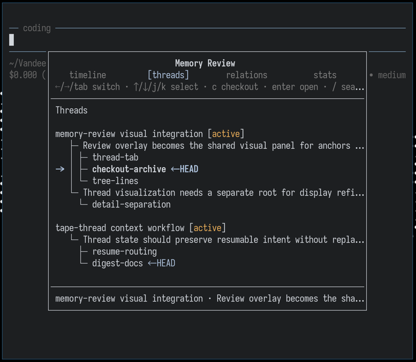
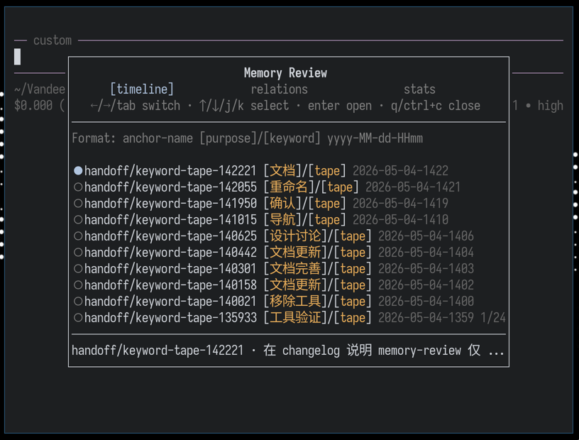

# pi-memory-md

Letta-like memory management for [pi](https://github.com/badlogic/pi-mono) using git-backed markdown files.

## Features

- **Persistent Memory**: Store context, preferences, and knowledge across sessions
- **Git-backed**: Version control with full history
- **Prompt append**: Memory index automatically appended to conversation at session start
- **On-demand access**: LLM reads full content via tools when needed
- **Multi-project**: Separate memory spaces per project

## Quick Start

```bash
# 1. Install
pi install npm:pi-memory-md
# Or for latest from GitHub:
pi install git:github.com/VandeeFeng/pi-memory-md

# 2. Create a git repository (private recommended)

# 3. Configure pi
# Add to ~/.pi/agent/settings.json:
{
  "pi-memory-md": {
    "memoryDir": {
      "repoUrl": "git@github.com:username/repo.git", // Or HTTPS format
      "localPath": "~/.pi/memory-md",
      "globalMemory": "global" // optional, global as default
    }
  }
}

# 4. Start a new pi session
# type /skill:memory-init slash command to initialize the memory files
```

> **Security recommendation**
>
> Configure `pi-memory-md` in global settings (`~/.pi/agent/settings.json`) instead of project settings (`.pi/settings.json`).
>
> If project settings could override these options, a repository could redirect your memory to another local path, point sync at a different remote repo, or enable automatic pull/push behavior you did not intend.
>
> For this reason, project-level `.pi/settings.json` does not override these `pi-memory-md` options: `repoUrl`, `localPath`, `memoryDir`, sync hooks, and `tape.tapePath`.

## How It Works

```
Session Start
    ↓
1. Git pull (sync latest changes)
    ↓
2. Scan all .md files in memory directory
    ↓
3. Build index (descriptions + tags only - NOT full content)
    ↓
4. Deliver memory index via `message-append` or `system-prompt`
    ↓
5. LLM reads full file content when needed
```

## Usage Examples

Simply talk to pi - the LLM will automatically use memory tools/skills when appropriate:

```
You: Save my preference for 2-space indentation in TypeScript files to memory.

Pi: [Creates or updates a memory markdown file with the standard file tools]
```

You can also explicitly request operations:

```
You: List all memory files for this project.
You: Search memory for "typescript" preferences.
You: Read core/USER.md
You: Sync my changes to the repository.
```

The LLM automatically:
- Reads memory index at session start (appended to conversation)
- Creates or updates memory markdown files when you ask to remember something
- Syncs changes when needed

## Available Capabilities

### Slash Commands In Pi

You can also use these slash commands directly in pi:

- `/memory-refresh`: Refresh memory context from files (rebuild cache and deliver into current session)
- `/memory-check [max-lines] [-p|-g|project|global]`: Check memory repository status and folder structure (tree output defaults to 25 lines). Examples: `/memory-check -g 30`, `/memory-check 21 -p`

### Built-in Tools & SKILLs

The LLM can use these tools and [skills](skills/) to interact with memory:

#### Memory Management Tools

| Tool | Parameters | Description |
|------|------------|-------------|
| `memory_sync` | `{action: "pull" / "push" / "status"}` | Git operations |
| `memory_search` | `{query?, grep?, rg?}` | Search by tags/description and custom grep/ripgrep patterns |
| `memory_check` | `{directory?: string}` | Check current project memory folder structure or a specific project subdirectory |

#### Memory SKILLs

| Skill | Description |
|-------|-------------|
| `memory-init` | Initialize the memory repository, clone/sync git, and create the basic directory structure |
| `memory-import` | Curate durable memory from URLs, folders, or files after confirming what should be preserved |
| `memory-write` | Create or update memory markdown files with valid frontmatter using native file tools |

User can easily extend their own workflows with these skills. Although this sacrifices some stability, it improves flexibility and user autonomy. This is a deliberate tradeoff after my careful consideration.

When multiple skills have the same name, pi uses the first one found in this order: project settings, project `.pi/skills/`, user settings, user `~/.pi/agent/skills/`, then packaged skills. This means project or user skills override the built-in packaged skills with the same name.

To disable packaged `pi-memory-md` skills, configure the package skills filter. Use an empty array to disable all skills, or exclude specific skill paths:

```md
{
  "packages": [
    {
      "source": "npm:pi-memory-md",
      "skills": [] // or ["!skills/memory-write/SKILL.md"]
    }
  ]
}
```

## Memory Delivery Modes

The extension supports two base modes for delivering memory into the conversation.
When tape mode is disabled, behavior is exactly as described below.
When tape mode is enabled, the same delivery mode still applies, but tape changes how memory files are selected.

### 1. Message Append (Default)

```
{
  "pi-memory-md": {
    ...
    "delivery": "message-append"
  }
}
```

- Memory is sent as a custom message delivered only once per session (on first agent turn)
- Not visible in the TUI (`display: false` in pi-tui)
  This hidden message is delivered in the same agent turn, so it does not create a second LLM request; it only adds tokens to the current request
- Persists in the session history
- **Pros**: Lower token usage, memory persists naturally in conversation
- **Cons**: Only visible when the model scrolls back to earlier messages

### 2. System Prompt

```
{
  "pi-memory-md": {
    ...
    "delivery": "system-prompt"
  }
}
```

- Memory is appended to the system prompt delivered on every agent turn
- **Pros**: Memory always present in system context
- **Cons**: Higher token usage (repeated on every prompt)

## Hooks

- `sessionStart: ["pull"]`: sync from upstream, fresh fetch/pull evidence within 12 hours skips another fetch.
  This avoids repeated network checks on every new session while still refreshing upstream periodically.
- `sessionEnd: ["push"]`: commit and push memory when the session ends.
- `beforeAgentStart: ["sessionBridge"]`: bridge prompt-relevant context from recent `new`/`resume`/`fork` previous sessions.

More trigger actions will be added later, even custom hooks.

## Full Configuration

```
{
  "pi-memory-md": {
    // "enabled": false,

    "memoryDir":{
    // git remote url
    "repoUrl": "git@github.com:username/repo.git", // Or HTTPS format

    // Root dir for all memory (cloned from repo) `~/.pi/memory-md` as default
    "localPath": "~/.pi/memory-md",

    // Shared memory folder name under localPath.
    // Only enabled when explicitly configured
    // "global" -> {localPath}/global, "foo/bar" -> {localPath}/bar.
    // "" or omitted -> disabled, "   " -> {localPath}/global, ".." -> {localPath}/global.
    "globalMemory": "global"
    },

    // `injection` is still accepted as a legacy alias for `delivery`.
    "delivery": "message-append",
    "hooks": {
      "sessionStart": ["pull"],
      "sessionEnd": ["push"],
      "beforeAgentStart": ["sessionBridge"]
    }
  }
}
```

| Setting | Default | Description |
|---------|---------|-------------|
| `enabled` | `true` | Enable extension |
| `memoryDir.repoUrl` | Required | Git repository URL |
| `memoryDir.localPath` | `~/.pi/memory-md` | Local memory clone path |
| `memoryDir.globalMemory` | disabled | Shared memory folder name (relative to `localPath`), enabled only when explicitly configured |
| `delivery` | `"message-append"` | Memory delivery mode: `"message-append"`, `"system-prompt"` |
| `hooks.sessionStart` | `["pull"]` | Actions to run when a session starts, `pull` syncs from upstream and skips another fetch when `FETCH_HEAD` is fresh within 12 hours |
| `hooks.sessionEnd` | `[]` | Actions to run when a session ends |
| `hooks.beforeAgentStart` | `[]` | Actions to run before the agent starts; `sessionBridge` bridges relevant context from recent `new`/`resume`/`fork` previous sessions |
| `tape.enabled` | `false` | Enable tape mode for dynamic context selection |
| `tape.thread` | `true` | Enable TapeThread tools and `/memory-thread` when tape mode is enabled |

When settings change, run `/reload` to apply them.

Legacy config is still supported:

```
{
  "autoSync": {
    "onSessionStart": true
  }
}
```

```
{
  "localPath": "~/.pi/memory-md",
  "repoUrl": "git@github.com:username/repo.git", // Or HTTPS format
}
```

## Memory File Format

```markdown
---
description: "User identity and background"
tags: ["user", "identity"]
created: "2026-02-14"
updated: "2026-02-14"
---

Markdown content...
```

## Directory Structure

```
~/.pi/memory-md/
├── global/                 # Optional shared memory when globalMemory is enabled
│   ├── USER.md             # Optional shared user profile and preferences
│   ├── MEMORY.md           # Optional shared durable notes, conventions, and lessons learned
│   └── TASK.md             # Optional shared task template
└── project-name/           # git rev-parse --show-toplevel
    ├── core/
    │   ├── USER.md         # Optional project user profile and preferences
    │   ├── TASK.md         # Optional project task template
    │   └── project/        # Project memory
    │       └── tech-stack.md
    └── notes/              # Optional other custom directories
```

## Tape Mode (Dynamic Context Delivery)

> **Experimental**: This mode is under active development. APIs and behavior may change.
>
> For the latest, install via GitHub: `pi install git:github.com/VandeeFeng/pi-memory-md`
>
> **Note**: This mode may consume more tokens. Adjust parameters based on your model's context window and your API quota.

More details [tape-design](docs/tape-design.md) / [中文版](docs/tape-design.zh.md)

Minimal setting:

```
{
  "pi-memory-md": {
    ...
    "tape": {
      // "enabled": false,
      "anchor": {
        "keywords": {
          "global": ["refactor", "migration"],
          "project": ["tape", "Emacs"]
        }
      }
    }
  }
}
```
Then use `/memory-anchor` to create an anchor manually, or let anchors be created automatically when configured keywords are triggered. If `manual` mode is off, capable models may also create anchors autonomously when they judge it useful.

If you want to jump to the conversation around an anchor and restart from there, `/tree` and the anchors in this session are all there with a customizable anchor label in pi TUI.

> **Note**: pi-memory-md does not create labels through pi's built-in label API. These anchor labels are only displayed in the `/tree` UI. Built-in pi labels are written into session records, and this project intentionally avoids that invasive design.
>
> This may cause some unnecessary runtime memory usage, but I consider the tradeoff necessary.

### Tape vs Delivery Modes

**Tape** is an independent feature that can be enabled alongside either delivery mode.
It does not change the delivery mechanism; it changes **which memory files** are selected.

| Tape | Delivery mode | Behavior |
|------|----------------|----------|
| Disabled | `message-append` | Sends memory once as a hidden custom message on the first agent turn |
| Disabled | `system-prompt` | Rebuilds memory and appends it to the system prompt on every agent turn |
| Enabled | `message-append` | Sends tape-selected memory once as a hidden custom message on the first agent turn |
| Enabled | `system-prompt` | Rebuilds tape-selected memory and appends it to the system prompt on every agent turn |

With tape enabled, the delivered content is still a memory index/summary for the model, but the file list is chosen by tape-aware selection logic instead of the basic project scan. In smart mode, the delivered list can also include recently active project file paths inferred from tool usage, plus a `recent focus` summary for each selected file showing the most recently attended `read` / `edit` ranges inside the same effective smart-scan window. Stale paths from old tape history are ignored when the file no longer exists.

A delivered tape hidden message looks like:

```xml
<memory_context mode="tape">
<instructions>
Tape is enabled for this conversation. Use tape tools when you need anchors or tape history.
Handoff mode: manual. `tape_handoff` is blocked unless the keyword is triggered or user create manually.
</instructions>
<memory_files>
- path: core/USER.md
  priority: high
  description: User profile and preferences
  tags: user, profile, preferences
  recent focus: read 12-28
</memory_files>
<active_project_files>
- path: /path/to/project/file
  priority: high
  recent focus: read 340-420, read 590-677, edit 340-399
</active_project_files>
</memory_context>
```

### Tape Anchors

Anchors are named checkpoints that correspond to pi session entries, marking important transitions in your conversation. They enable efficient context reconstruction and are mirrored into pi `/tree` labels:


Each line in the tape anchor store is a JSON record:
```json
{"id":"1234567890-abc123","timestamp":"2026-04-04T12:00:00.000Z","name":"task/begin","type":"handoff","meta":{"summary":"Working on feature X","purpose":"feature","trigger":"manual"},"sessionId":"019dbd12-90b7-72b1-a88d-843706db32de","sessionEntryId":"446b6c33"}
```

Each anchor has:
- **`id`**: A stable unique identifier, auto-generated from `sessionEntryId:timestamp:name`
- **`name`**: A human-readable label (e.g., `session/new`, `task/begin`)
- **`type`**: Anchor type - `session` for lifecycle anchors, `handoff` for manual/semantic transitions, `thread` for TapeThread checkpoints
- **`sessionId`**: The pi session this anchor belongs to
- **`sessionEntryId`**: The associated session entry ID for tree mirroring
- **`timestamp`**: ISO timestamp of when the anchor was created
- **`meta`**: Optional metadata including `summary`, `trigger`, `keywords`, `purpose`. `purpose` is a 1-2 word label (e.g., `feature`, `review`, `deploy`). `trigger` can be `direct` (agent auto), `keyword` (configured keywords matched), or `manual` (explicit user/tool call)

In short, tape anchors are markers that connect user intent with conversation history.

When a user asks the agent to retrieve relevant information from a large memory space, the real query is often not a precise string match. It is more often a vague intention, decision, or task transition.

Stored within pi session entries, tape anchors as explicit markers link intent back to the exact place where it appeared in the session history and to the larger body of memory data around it, which can be more useful than only optimizing RAG-style retrieval over raw text or database records.

Beyond context engineering, `tape anchors` is an implementation of text recording and management.

Large context windows do not remove the need for careful context control. Before relying on RAG, traditional marking, indexing, and search discipline still matter. The quality of text given to the LLM, and the way that information is recorded and managed, directly affect how relevant the model's answers will be.

Instead of asking the LLM to infer the user's intent from vague semantic signals later, it is better to record that intent when the user expresses it.

Keywords make this intent-recording process more practical. When a configured keyword matches, keyword detection sends a hidden message that asks the agent to consider creating a keyword anchor, and the agent can still refuse when the anchor would not be useful. Anchor names are also mirrored into pi `/tree` labels for the session nodes they attach to, with stale labels cleaned up before resync.

Lifecycle anchors (`session/*`) are created automatically, handoff anchors can be created manually via `/memory-anchor`, and thread anchors can be created manually via `/memory-thread`.

When `mode: "manual"` is set, autonomous handoff anchors creation is blocked unless it comes from `/memory-anchor` or a matched keyword instruction. TapeThread content mutations (`create`, `root`, `branch`, `update`, `archive`) are also blocked unless authorized through `/memory-thread`; read/navigation actions such as `status`, `search`, `resume`, and `checkout` remain available. In manual mode, the agent will not proactively create handoff or thread mutation anchors on its own.

The combination of anchors and keywords closes the loop: intent -> memory data -> intent, while keeping automation under user control.

Prompts should evolve into intent.

### Tape Thread



Tape Thread is a lightweight memory-thread layer built on top of tape anchors. It turns long-running work into a small tree of resumable checkpoints: a thread has one or more root nodes, branches can split from the current HEAD, and each node can keep its summary, decisions, next steps, relevant files, and memory links.

`thread -> root node -> branch -> node`, each `thread-anchor` is a node, and linking them together forms a thread. A thread represents a specific topic or task the user is working on. Within a thread, you can set multiple key nodes, and each node can grow follow-up branches, forming a thread forest structure. I think it's better than linear management such as TASK.md.

Use `/memory-thread <prompt>` for natural-language thread management. The `tape_thread` tool supports actions such as `create`, `root`, `branch`, `checkout`, `status`, `search`, `update`, `resume`, and `archive`. Thread nodes are stored as `type: "thread"` anchors and linked in a project thread JSONL file, so the conversation can resume from compact intent state instead of rereading the whole chat.

In `mode: "manual"`, the agent can still read, search, resume, and checkout threads, but it cannot create or mutate thread anchors unless the user authorizes it through `/memory-thread`.

More details: [Tape thread design](docs/tape-thread-design.md)

```txt
                   thread: tape dev
                          |
          +---------------+---------------+
          |                               |
 root node: anchors             root node: workflow
          |                               |
   +------+------+              +---------+---------+
   |      |      |              |         |         |
branch: branch: branch:      branch:   branch:   branch:
session handoff review       store     manual    docs
   |      |      |              |         |         |
node:   node:  node:         node:     node:     node:
record  gate   browse        HEAD      command   explain
start   calls  anchors       state     control   forest
```

### Tape Review



`/memory-review` opens an interactive overlay for browsing tape anchors and threads. Select an anchor or thread node to jump directly to the first assistant entry after it in the session tree.

The panel provides:

- **Timeline view**: Browse all anchors in the current project chronologically
- **Threads view**: Browse thread nodes, jump to node anchors, press `c` to checkout a node, or press `a` to archive a thread
- **Keyword relations**: Visual connections between anchors and their keywords
- **Stats overview**: Quick summary of anchor counts, types, and distributions
- **Fuzzy search**: Type `/` to filter anchors and thread nodes — press `Esc` or `Ctrl+c` to leave search input
- **Anchor deletion**: Select a non-thread anchor and press `Ctrl+d` to delete it

The panel helps you land on the right anchor or thread node. After jumping there, any deeper branching or tree operations still belong in Pi's native `/tree` panel. This design is intentionally non-invasive.

### Full Configuration

```
{
  "pi-memory-md": {
    ...
    "localPath": "~/.pi/memory-md",
    "tape": {
      // Run tape only inside a Git repository by default
      // Uses `git rev-parse --show-toplevel`; if it fails, tape is skipped
      "onlyGit": true, // default

      // Absolute directory paths where tape is always disabled
      // Built-in system/temp directories are also excluded by default
      "excludeDirs": [
        "/absolute/path/to/sandbox"
      ],

      // TapeThread tools and /memory-thread (default: true)
      // "thread": false,

      "context": {
        // "smart": ranks memory files plus recent project file activity from session history (default)
        //          repeated accesses get diminishing returns, edit/write outrank plain reads,
        //          recent accesses get a recency bonus, missing/stale paths are ignored,
        //          and handoff boosts only apply near the latest anchors
        // "recent-only": most recently modified memory files only
        "strategy": "smart", // default

        // Max files to deliver into LLM context
        "fileLimit": 10, // default

        // Smart-mode pi session history scan range: [startHours, maxHours]
        // Scans history incrementally by 24-hour steps, starting from startHours.
        // Stops and uses the result once the sample reaches MIN_SMART_ACCESS_SAMPLES (5).
        // Otherwise keeps expanding until maxHours is reached.
        "memoryScan": [72, 168], // default

        // "alwaysInclude" is deprecated
        // Files or directories to always include in context (optional, defaults to empty)
        "whitelist": [
          "core/USER.md",
          "docs/tape-design.md"
        ],

        // Files or directories to always exclude from context (optional, defaults to empty)
        // Other paths still go through rg ignore rules first, then the built-in default ignore list.
        "blacklist": [
          "node_modules",
          "dist"
        ]
      },
      "anchor": {
        // "auto": LLM may create handoff anchors when it decides they are useful
        // "manual": direct tape_handoff is hard-blocked
        // hidden keyword instructions and /memory-anchor still work in manual mode
        "mode": "auto", // default

        // Prefix mirrored into pi /tree labels for anchor nodes
        "labelPrefix": "⚓ ", // default

        "keywords": {
          // Match against user prompts with length in [10, 300]
          // When matched, send a hidden instruction about the tape_handoff tool call
          // It stays in the same agent turn: no extra LLM request, only extra tokens in the current request
          // This gives the agent room to refuse when creating a keyword anchor is not necessary at all
          // Strongly recommended! Keywords make anchor creation much smarter - customize based on your focus areas
          "global": ["refactor", "migration"],
          "project": ["tape", "Emacs"]
        }
      },

      // Custom tape path (optional)
      // If not set, default is {localPath}/TAPE: ~/.pi/memory-md/TAPE
      // Anchor index files (.jsonl) will be stored directly under this path
      "tapePath": "/custom/path/to/tape"
    }
  }
}
```

### Tape Tools, Skills & Slash Commands

| Name | Parameters | Description |
|------|------------|-------------|
| `/memory-anchor` | `<prompt>` | Slash command that asks the LLM to derive and create a manually authorized handoff anchor |
| `/memory-review` | `[limit]` default: `50`, max: `100` | Slash command that opens an interactive Memory Review overlay for browsing anchors by timeline, keyword relations, stats, and `/` fuzzy search |
| `memory-digest` | skill | Digest recent tape anchors and session context into proposed durable memory updates |
| `tape_handoff` | `{name, summary?, purpose?}` | Create a handoff anchor checkpoint in the tape |
| `tape_delete` | `{id?, ids?}` | Delete anchor checkpoints by exact id only; use `tape_search` first to find ids |
| `tape_info` | `{}` | Get tape statistics and information |
| `tape_search` | `{kinds?, types?, limit?, contextLines?, sinceAnchor?, lastAnchor?, betweenAnchors?, betweenDates?, entryScope?, anchorScope?, scan?, anchorName?, anchorType?, anchorSummary?, anchorPurpose?, anchorKeywords?}` | Search tape entries and anchors, including structured anchor filters and optional nearby anchor context |
| `tape_read` | `{afterAnchor?, lastAnchor?, betweenAnchors?, betweenDates?, scan?, types?, entryScope?, anchorScope?, limit?, maxContentChars?}` | Read tape entries as formatted messages |
| `tape_reset` | `{archive?: boolean}` | Reset the tape with a new session lifecycle anchor |

> **Note**: Tape tools are registered when a `tape` block exists in config (opt-out: set `"enabled": false`). They provide anchor-based context management inspired by [bub](https://bub.build)'s tape mechanism.

## Reference
- [Introducing Context Repositories: Git-based Memory for Coding Agents | Letta](https://www.letta.com/blog/context-repositories)
- https://tape.systems
- https://bub.build/
- https://github.com/bubbuild/bub/tree/main/src/bub

